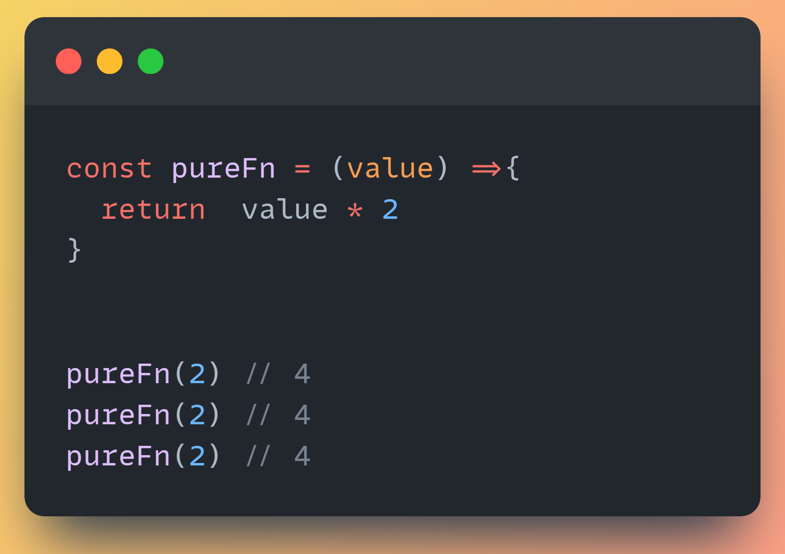
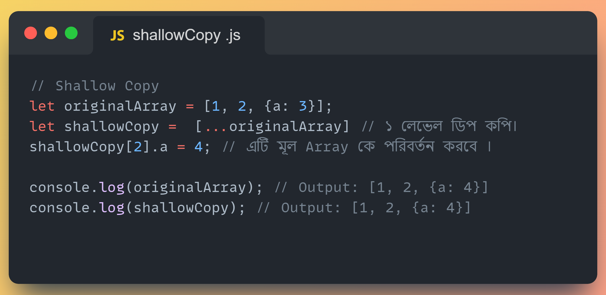
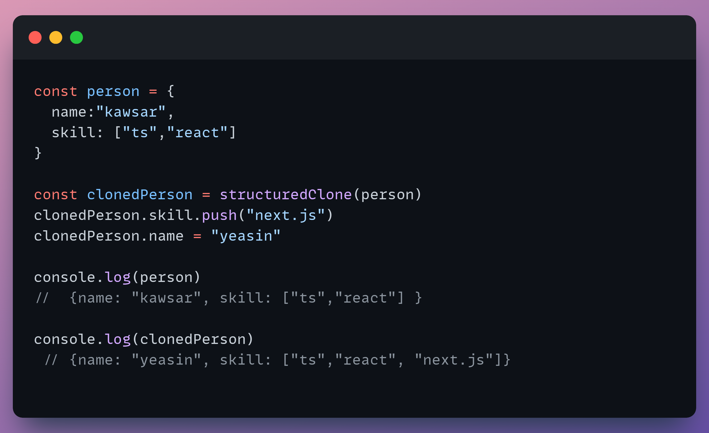
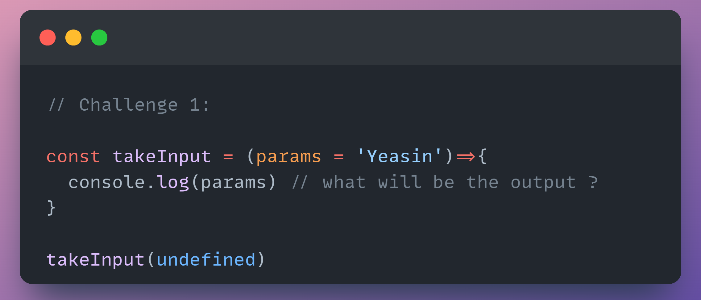

## Beyond JavaScript

##### JavaScript ও Web Development এর Eco System গভিরভাবে জানার জন্য ও ইন্টারভিউ জিজ্ঞাসা করার মত গুরুত্বপূর্ণ সব প্রশ্ন ও উত্তর সমূহ একত্রে । আশা করি প্রতিটি Developer উপকৃত হবেন ।

##### বর্তমানে সকল  প্রশ্নসমুহ সংগ্রহ  করা হচ্ছে ।  ধীরে ধীরে সকল উত্তরসমূহ যোগ  করার  পর  তা  রিডেবিলেটির জন্য একটা  ওয়েবসাইটে যুক্ত করা  হবে । 


<!--
##### সকল কন্ট্রিবিউটোরস যাদের প্রতি কৃতজ্ঞতা প্রকাশ করছি।


 -->

<br>

### নির্দেশনা

- কোনো সাজেসন্স,রিকুয়েস্ট থাকলেঃ <a href="https://github.com/yeasin-2002/We-Do-not-Know-JS/issues"> Issue </a> ক্রিয়েট করুন

- কোনো প্রশ্ন না বুঝলে বা বিস্তারিত জানতে চাইলেঃ <a href="https://github.com/yeasin-2002/We-Do-not-Know-JS/discussions"> Discussion </a> এ জিজ্ঞাসা করুন ।

- Contribute করতে চাইলেঃ <a href="https://github.com/yeasin-2002/We-Do-not-Know-JS/blob/main/CONTRIBUTING.md"> Contributions Guideline </a> পড়ুন ।

<br>

### সূচিপত্র

- [JavaScript](#js)
- [TypeScript](#ts)
- [React.js](#reactjs)
- [Next.js](#nextjs)
- [Node/Express](#node-express)
- [Database](#database)
- [Guess The Output Challenge](#GTO)

<br>

<hr>

<h3 align="center" id="js">  JavaScript</h3>

<div>

<details>
<summary> ১.  Local storage ও  session   এর মধ্যে পার্থক্য কি ?  </summary>

#### <span style="color:#f43f5e;">উঃ</span> local storage ও session এর মধ্যে পার্থক্য হলোঃ

| পার্থক্য  | Local Storage                                                        | Session Storage            |
| --------- | -------------------------------------------------------------------- | -------------------------- |
| স্থায়ীত্ব | মা্যানুয়ালি বা প্রোগ্রামিক্যালি ব্রাউজার ডাটা ক্লিয়ার না করা পর্যন্ত | ট্যাব ক্লোস করার সাথে সাথে |
| এভাইলেবল  | সকল window তেই                                                       | নির্দিষ্ট ট্যাবেই          |
| উপযোগী    | দীর্ঘ সময় ডাটা রাখায়                                                 | আল্প সময় ডাটা রাখায়        |

</details>

<details>
<summary> ২. DOM ও BOM এর মধ্যে পার্থক্য কি ?  </summary>

#### BOM ও DOM ব্রাউজারের JavaScript এর Window Object এর উপাদান । ব্রাউজারে সকল কিছু window নামের একটা master object এর থেকে একসেস করা যায়

BOM ও DOM এর মধ্যে পার্থক্য হলোঃ

| বিষয়          | DOM                                                              | BOM                                                |
| ------------- | ---------------------------------------------------------------- | -------------------------------------------------- |
| পূর্ননাম      | Document Object Model                                            | Browser Object Model                               |
| ব্যখ্যা       | HTML ও XML documents যার মাধ্যমে হোস্ট এনভাইরমেন্ট এর স্ট্রাকচার | ব্রাউজার স্পেসিফিক ফাংশনালিটি                      |
| উপাদান        | Elements, Attributes, Text, etc.                                 | Window, Screen, Location, History, Navigator, etc. |
| নিয়ন্ত্রনকারী | W3C                                                              | প্রতিটি ব্রাউজারে ভিন্ন ভিন্নভাবে ইম্প্লিমেন্ট করে |

</details>

<details>
<summary>৩.  Pure Function কাকে বলে ?     </summary>

#### Computer Science এর ভাষায় যে সকল function ইন্টার্নাল লজিক নিয়ে থাকে ও একই Input এর জন্য একই Output দিয়ে থাকে তাকে Pure Function বলে ।

এর ২টা বৈশিষ্ট থাকে

- নিজের বিজনেস লজিক নিয়ে কনসার্ন ।
- Same Input এর জন্য Same output দিয়ে থাকে ।

Pure Function এর উদাহরণঃ



এখানে pureFn কে Input হিসেবে যতবারই ২ দেয়া হবে এটি প্রতিবার ৪ রিটার্ন করবে ।

এখানে Pure function নীতি ২টি সঠিকভাবে ফলো করা হয়েছে ।

১. প্রতিবার same input এর জন্য same output দিবে ।

২. বাহিরের কোনো প্রকার স্টেট বা কিছু প্ররিরর্তন করে নাই

অপরদিকে,


impureFn এর ক্ষেত্রে Pure function নীতি ২টি সঠিকভাবে ফলো করা হয়নি ।

১. প্রতিবার same input দিলেও আলাদা আলাদা output দিচ্ছে ।

২. এটি বাহিরের count variable পরিবর্তন করছে, অর্থাৎ শুধুমাত্র নিজের লজিক নিয়ে কনসার্ন না , function টি নিজের body এর বাহিরের কিছু পরিবর্তন করে ফেলেছে ।

তাই এটি pure function না ।

</details>

<details>
<summary>৪.  Falsy  ভ্যালু কোনগুলেকে বলে?  </summary>

#### 0, "", null, undefined, NaN, false এগুলোকে falsy ভালু বলে ।

</details>

<details>
<summary>৫.  falsy ও  nullish ভ্যালু এর মধ্যে পার্থক্য কি ?  </summary>

#### Falsy value বলতে 0, "", null, undefined, NaN, false কে বুঝায় এবং nullish value বলতে null, undefined কে বুঝায় ।

nullish value মুলত falsy value এর সাবসেট ।

##### ওপারেটর

- falsy value এর জন্য || দিয়ে চেক করা যায়
- nullish value ডিটেক্ট করতে ?? ব্যবহার করা হয়

</details>

 <details>
 <summary>৬.   Shallow Copy ও Deep Copy বলতে কি বুঝায়?   </summary>

#### কোনো Object বা Array ১ লেভেল ডিপ কপি করতে গেলে তাকে Shallow Copy বলে । আর ২ লেভেল বা ততোধিক ডিপ কপি করতে গেলে তাকে Deep Copy বলে ।

#### উদাহরণঃ

১. Shallow Copy

  

এখানে,
original array কে Spread Oparetor দিয়ে কপি করা হয় ।
যেহেতু origianl array এর মাঝে অবজেক্ট আছে তাই এখানে অবজেক্ট এর ক্ষেত্রে একই রেফারেন্স দিয়ে কপি হয়েছে । তাই যখন আমরা original array এর অবজেক্ট এর কোনো প্রপার্টি চেঞ্জ করবো তখন কপি করা array এর অবজেক্ট এর কোনো প্রপার্টি চেঞ্জ হয়ে যাবে ।

২. Deep Copy

  

এখানে,
original object কে Spread Oparetor দিয়ে কপি করা হয় এবং তার পাশাপাশি এর ভিতরের Object কেউ আবার Spread Oparetor দিয়ে কপি করা হয়েছে । তাই এডি ২ লেভেল নেস্টেড হবার পরো সম্পুর্ন Deeply Copy হয়ে

Tips: অনেক লেভেলের ডিপ কোনো Object/Array যদি Immutadly পরিবর্তন

 </details>

<details>
<summary>৭.  Deep Copy   এর ক্ষেত্রে JSON.stringify ও পরে আবার JSON.parse করে  করলে এই  পদ্ধতি কি ব্যবহার করা  উচিত?    </summary>

### Deep Copy এর ক্ষেত্রে JSON.stringify ও পরে আবার JSON.parse করা হয় যা আসলে উচিত না ।

যেমনঃ


কারনঃ

- যদি কোনো `Object` এর মধ্যে কোনো `funtion` থাকে তাহলে সেটি `JSON.stringify` করলে সেটি `String` হয়ে যায় । এবং সেটি পরে আবার `JSON.parse` করলে সেটি `String` থেকে অবজেক্ট হয়ে যায় । কিন্তু সেটি `funtion` হওয়া সত্ত্বেও সেটি `funtion` হিসেবে কাজ করবে না । কারন সেটি `String` হয়ে গেছে । তাই এই পদ্ধতি ব্যবহার করা উচিত না ।

- `Object` হলো `JavaScript` এর বিশেষ ডাটা টাইপ , এক্ষেত্রে এর ফলে এটি `String` হয়ে যাবে এবং সেটি পরে আবার `Object` হিসেবে কাজ করবে না অনেক ক্ষেত্রে কারন এর Prototype কে সেটি হারিয়ে যাবে ।

</details>

 <details>
 <summary>৮.  Event Propagation ও Event Delations  কাকে বলে?  </summary>
 
 ### Event Propagation
  JavaScript-এ Event Propagation হলো একটি ইভেন্ট হ্যান্ডলিং প্রক্রিয়া যা তিনটি ফেজে ঘটে: Capturing Phase, Target Phase, এবং Bubbling Phase. এই তিনটি ফেজে ঘটে একটি ইভেন্ট হ্যান্ডলিং প্রক্রিয়া।

### Event Delations

প্যারেন্ট এলিমেন্ট এর উপর একটি ইভেন্ট হ্যান্ডলার সেট করে এবং এই ইভেন্ট হ্যান্ডলার এর মাধ্যমে চাইল্ড এলিমেন্ট এর উপর ইভেন্ট হ্যান্ডলার সেট করা হয় তাকে Event Delations বলে ।

 </details>

  <details>
  <summary>৯.  Event Bubbling  বনাম Event Delegations এর মধ্যে  পার্থক্য কি?  </summary>
  Ans:
  </details>

  <details>
  <summary> ১০.  event.target ও event.currentTarget ও this.target  এর মধ্যে পার্থক্য কী ? </summary>
  Ans: 
  </details>

  <details>
  <summary>১১. Single Responsible principal কাকে বলে?  </summary>
  Ans:
  </details>

  <details>
  <summary>১২.  primitive ও   non-primitive data types  এর  মধ্যে  পার্থক্য কি? উভয়ের একটী করে উদাহরণ দেও
   </summary>

Ans:

  </details>

  <details>
<summary> ১৩. JavaScript এ   null and Undefined এর মধ্যে পার্থক্য কি ?   </summary>

- নাল এর সাধারণ ব্যবহার
  একটি ফাংশন প্যারামিটার হিসাবে, এর অর্থ হল যে ফাংশন প্যারামিটার কোনও অবজেক্ট নয়

```javascript
function myFn(obj) {
  if (null == obj) {
    // code
  }
}
```

- অবজেক্ট প্রোটোটাইপ চেইন শেষ হিসাবে

```javascript
Object.getPrototypeOf(Object.prototype);
```

- ভেরিয়েবলটি মুক্ত করার সময়, ভেরিয়েবলটিকে নাল বরাদ্দ করুন

```javascript
let o = {
  code: 'abc'
};
o = null;
```

- অপরিশোধিত এর সাধারণ ব্যবহার
  ভেরিয়েবল ঘোষিত হলেও নির্ধারিত নয়, ভেরিয়েবলের মান নির্ধারিত হয়

```javascript
let o;
console.log(o); //undefined
```

- ফাংশনটি সরবরাহ করা উচিত যে পরামিতি কল করার সময় সরবরাহ করা হয় না, তারপরে প্যারামিটারের মান সরবরাহ করা হয় না

```javascript
function myFn(o) {
  console.log(o);
}
myFn(); //undefined
```

- বৈশিষ্ট্য যা অবজেক্টটি ধারণ করে না, মানটি সংজ্ঞায়িত

```javascript
let o = {
  code: 'abc'
};
console.log(o.name); //undefined
```

- যখন ফাংশনটি কোনও মান ফেরত দেয় না, এটি ডিফল্টরূপে অপরিবর্তিত থাকে

```javascript
function myFn(obj) {
  obj = 'a';
}
console.log(myFn()); //undefined
```

- নাল এবং undefined মধ্যে মিল
  বুলিয়ান রূপান্তরিত হলে মিথ্যা

```javascript
console.log(Boolean(null)); // false
console.log(Boolean(undefined)); // false
```

নাল এবং undefined মধ্যে পার্থক্য
কোনও সংখ্যায় রূপান্তরিত করার সময় ফলাফলটি পৃথক। নাল রূপান্তরকরণের ফলাফলটি 0 এর একটি বৈধ সংখ্যা মান এবং অপরিবর্তিত রূপান্তরের ফলাফল NaN হয়।

```javascript
console.log(Number(null)); // 0
console.log(Number(undefined)); // NaN
```

- দুটি প্রকারের ধরন পৃথক, নাল প্রকারের অবজেক্ট এবং undefined প্রকারটি undefined।

```javascript
console.log(typeof null); //object
console.log(typeof undefined); //undefined
```

- নাল এবং undefined তুলনা করুন
  নাল এবং undefined মধ্যে পার্থক্য করার জন্য, শুধুমাত্র একত্রিত হতে পারে cong একত্রিত করে, এটি দুটি প্রকারের সমান কিনা তা কঠোরভাবে তুলনা করবে।

```javascript
console.log(Boolean(null == undefined)); // true
console.log(Boolean(null === undefined)); // false
```

- যোগফল

উপরের তুলনার পরে, আমাদের এই দুটি প্রকারের একটি স্পষ্ট ধারণা রয়েছে। সাধারণত যখন কোডটি লেখার সময় কোনও ভেরিয়েবলের একটি কার্যকর মান আছে কিনা তা আমরা বিচার করি তখন আমাদের দুজনের মধ্যে পার্থক্য করার প্রয়োজন হয় না, কেবল এটি বুলিয়ান টাইপ হিসাবে ব্যবহার করুন। কিন্তু যখন সম্পত্তিটি রয়েছে কিনা তা বিচার করার দরকার রয়েছে, আমাদের অবশ্যই টাইপটি কঠোরভাবে অবধারিত হিসাবে বিচার করতে হবে। অবশেষে, আমরা যদি একটি সংখ্যাসূচক মান পাস করি তবে অবশ্যই আমাদের প্রথমে রায় দিতে হবে, এবং সরাসরি একটি সংখ্যার ধরণের কাছে সরাসরি কাস্ট করা যাবে না, অন্যথায় নাল আমাদের অস্বাভাবিক ফলাফল পেতে বাধ্য করবে এবং অপরিবর্তিত সরাসরি অবৈধ ফলাফলের এনএএন গণনা করবে।

</details>

<details>
<summary> ১৪.  “  Array, Objects are mutable and string, number, Boolean  are immutable “ এখানে mutable ও immutable দ্বারা কি বুঝানো  হয়েছে ।  </summary>

### Ans:

</details>

<details>
<summary>  structuredClone  কিভাবে কাজ করে ?  </summary>
<span style='color:#f43f5e;'>উঃ</span>



কোনো একটী Object/Array কে Copy করতে হলে আমরা সাধারনত `spread operator` বা `Slice` ব্যবহার করি ।

যেমন

```jsx
const skill = ['html', 'css', 'js'];

const cloneWithSlice = skill.slice();
const cloneSpread = [...skill];
```

কিন্তু যদি এটি আরও ভিতর আরও আবার কোনো Array/Object থাকত তখন সেই পার্ট নিজেদের আবার Spread দিয়ে করা প্রয়োজন Deep Copy করতে হলে ।

সহজে করতে আমরা সবাই Immer ব্যবহার করি যা একটি থার্ড পার্টি লাইব্রেরি । তবে বর্তমানে JavaScript এর বিল্ড ইন মেথদ আছে যা দিয়ে সহজে এটি করা যেতে পারে ।

```jsx
const person = {
  name: 'yeasin',
  skill: ['typeScript', 'react']
};

const cloneWithStructured = structuredClone(person);
```

### **[Syntax](https://developer.mozilla.org/en-US/docs/Web/API/structuredClone#syntax)**

```jsx
structuredClone(value);
structuredClone(value, options);
```

### Reference

- [MDN](https://developer.mozilla.org/en-US/docs/Web/API/structuredClone#syntax)
- [MDN The structured clone algorithm](https://developer.mozilla.org/en-US/docs/Web/API/Web_Workers_API/Structured_clone_algorithm)
- [Can I use](https://caniuse.com/?search=structuredClone)
- You Tube: **[James Q Quick](https://www.jamesqquick.com/blog/deep-clones-javascript-structuredclone/)**

# Warning:

- এটি `ES2022` এর ফিচার তাই Node 17+ ও লেটেস্ট ব্রাউজারে সাপোর্ট করে শুধু । এক্ষেত্রে `TypeScript` ব্যবহার করা হলে `Perser` হিসেবে ব্যবহার করলে তখন এটি চাইলে আগের কোনো `JS Verson` এ কনভার্ট করতে পারেন ।
- কোনো Object এর ক্ষেত্রে যদি `functions` থাকে তাহলে সেটির ক্ষেত্রে এটি Deep Copy করতে পারে না

</details>

</div>

<h3 align="center" id="ts">  TypeScript</h3>

<div>
<details>
<summary>১. any  ও unknown এর মাঝে কি পার্থক্য কি ?  </summary>

#### <span style="color:#f43f5e;">উঃ</span> any এবং unknown উভয়ই TypeScript এর বিশেষ ধরনের টাইপ যা যে কোন variable এ ডিক্লেয়ার করা যায় , তবে এগুলি বিভিন্ন পরিস্থিতিতে ব্যবহার করা হয়:

- `any` : এই টাইপটি TypeScript Officially নিজেরা Recommend করে না । আপনি একটি `any` টাইপে যে কোন মান নির্ধারণ করতে পারেন এবং কোন কম্পাইল সময় চেক ছাড়াই একটি `any` টাইপের যে কোন বৈশিষ্ট্য অ্যাক্সেস করতে পারেন। এটি একটি ভেরিয়েবলের জন্য টাইপ চেকিং থেকে বাদ দেওয়ার মতো।

- `unknown` : এই টাইপটি `any` এর টাইপ-নিরাপদ বিকল্প । একটি `unknown` টাইপে যে কোন মান নির্ধারণ করতে পারা যাবে , তবে আপনি কোন প্রকার টাইপ চেকিং না করলে একটি `unknown` টাইপের যে কোন বৈশিষ্ট্য অ্যাক্সেস করতে, তাদের কল করতে / বানাতে করতে বা যে কোন expresstions ব্যবহার করতে পারবেন না (সমানতা চেক ছাড়া)।
</details>

<details>
<summary>১. TypeScript generics এর  default value  কিভাবে দেয়া যায় ?    </summary>

#### <span style="color:#f43f5e;">উঃ</span> any এবং unknown উভয়ই TypeScript এর বিশেষ ধরনের টাইপ যা যে কোন variable এ ডিক্লেয়ার করা যায় , তবে এগুলি বিভিন্ন পরিস্থিতিতে ব্যবহার করা হয়:

- `any` : এই টাইপটি TypeScript Officially নিজেরা Recommend করে না । আপনি একটি `any` টাইপে যে কোন মান নির্ধারণ করতে পারেন এবং কোন কম্পাইল সময় চেক ছাড়াই একটি `any` টাইপের যে কোন বৈশিষ্ট্য অ্যাক্সেস করতে পারেন। এটি একটি ভেরিয়েবলের জন্য টাইপ চেকিং থেকে বাদ দেওয়ার মতো।

- `unknown` : এই টাইপটি `any` এর টাইপ-নিরাপদ বিকল্প । একটি `unknown` টাইপে যে কোন মান নির্ধারণ করতে পারা যাবে , তবে আপনি কোন প্রকার টাইপ চেকিং না করলে একটি `unknown` টাইপের যে কোন বৈশিষ্ট্য অ্যাক্সেস করতে, তাদের কল করতে / বানাতে করতে বা যে কোন expresstions ব্যবহার করতে পারবেন না (সমানতা চেক ছাড়া)।
</details>

</div>

<h3 align="center" id="reactjs">  React.js</h3>

<div> 
 <details>
 <summary> ১.  React ও React-DOM কী? Website বানাতে ২টি আলাদা আলাদা ইন্সটল কেন করতে  হয়?  </summary>
 
React.js বলতে React ও React-DOM  এর সমন্বয়ে একটা  প্যাকেজ বুঝায় । যদিও ২টি আলাদা আলদা ভূমিকা রাখে  ।

##### React : এটি মূলত JavaScript ওয়েব ও অ্যাপ এর জন্য একটি প্যাকেজ ও কাচামাল বলা যায় ।

কিভাবে রিয়েক্ট কাজ করবে তার নির্ধারণ করে ।

##### React-DOM : Browser DOM এর একটি কপি বা শেডো ডম । মূলত React এ কোনো State পরিবর্তন হলে সেটি আগে Virtual-DOM (V-DOM) এ সেটি পরিবর্তন করে এবং তা ডিফিং বা রি- কনসালেসশন এলগোরিদম এর মাধ্যমে কোন component এ পরিবর্তন হয়েছে সেটি এই খসড়া ডমে পরিবর্তনের এরপর সারর্জিক্যাল অপারেশনের এর মাধ্যমে মূল ডমে পরিরর্তন করে

 </details>

 <details>
 <summary>২.  “React is Reactive ” এইটি দ্বারা React কি  বুঝাতে চাচ্ছে? </summary>
 
 ### React এর কোনো State   পরিবর্তনের সাথে সাথে Component Re-render এর মাধ্যমে Updated Sate টি Brower DOM এ  Automatically পরিরর্তন করে ।  তাই বলে হয় রিয়েক্ট রিয়েক্টিভ  মানে State  পরিবর্তনের  সাথে সাথে তা রিয়েক্ট করে ও তার  ফলাফল মূল ডমে রিফলেক্ট করে

 </details>

 <details>
 <summary>৩.  HTML,CSS  এর রেন্ডারিং প্রোসেস কি কি?  </summary>
 Ans:
 </details>
 
 <details>
 <summary>৪.  React State Update এর ক্ষেত্রে Batch Update বলতে কি বুঝায় ? </summary>

### React এর কোনো State Update হলে তা সাথে সাথে মূল ডমে পরিবর্তন রিফলেক্ট করে না । অর্থাৎ, একত্রে পরিবর্তিত Sate সমূহ মূল ডমে Update করে ।

অনেক State একত্রে গ্রুপ আকারে update করাকেই Batch Update বলা হয় ।

 </details>

 <details>
 <summary>৫.  একাধিক DOM Operations এর ক্ষেত্রে Browser DOM  কি আসলেই Slow?   এক্ষেত্রে React  কিভাবে DOM Operations Optimize করতে পারে ।  </summary>
 
###  Browser DOM Operations  Slow নয় তবে পার্সিনং থেকে  Display পার্ট    প্রতি অপারেশনের  করতে হয় ।    এক্ষেত্রে React.js Batch Update এর মাধ্যমে   একত্রে সব State update  করে ।

#### ফলে কম ওপারেশন হয় সেটির ক্ষেত্রে কম Parsing and Display process থাকায় DOM Optimize হয়

 </details>

 <details>
 <summary>৬.  ডিফিং বা  রি- কনসালেসশন এলগোরিদম কাকে বলে? এবং React-DOM এটিকে কোন ক্ষেত্রে ব্যবহার  করে ? </summary>
Application এর কোনো State পরিবর্তন হলে সেটি  রেন্ডার ট্রি এর মাঝে খুজঝে তা মূল ডমে তা update  করতে  Diffing Algorithm  ব্যবহার করা হয় ।

#### মূলত, রিয়েক্ট একটি Component Tree বা Render Tree মেইন্টাইন করে । তাই কোনো Component এ State পরিবর্তন হলে সেই Component টি রেন্ডার ট্রি থেকে খুজে বের করার জন্য যে Algorithm ব্যবহার করে তাকে ডিফিং বা রি- কনসালেসশন এলগোরিদম বলে ।

 </details>

 <details>
 <summary>৭.  React Component এর নাম Capital Letter দিয়া শুরু কেন করতে হয় ?  </summary>
 Application এর function  JSX  রিটার্ন করতে পারে আবার অন্য যেকোনো ভ্যালু ।

এক্ষেত্রে কোনটি JSX রিটার্ন করে এমন , অর্থাৎ কোনটী কোম্পোনেন্ট আর কোনটি সাধারণ function তার নির্নয়ের জন্য Component এর নামে Capital Letter দিয়ে শুরু করতে হয় ।

 </details>

 <details>
 <summary> ৮.  “Props are Immutable” এর মানে কি ?  </summary>
 
Immutable এর মানে অপরিবর্তনযোগ্য ।  সাধারনত modifications  করা  যাবে না এমন বুঝায় তবে Replace করা যাবে  এমন । 
 React Components এর  Props হিসেবে একটি Object পেয়ে থাকি  ।

যেমনঃ

```jsx
**export const ReactComponentsDemo = (props) => {
 const {name,id} = props;

  return <div >index</div>;
};**
```

এই Props নামের Object a আমরা name, id পাচ্ছি ।

উদাহরণ হিসেবে এমন ধরতে পারি,

```jsx
{
id: 1,
name: "yeasin",
}
```

এক্ষেত্রে কোনো কারনে বা কোনো event এর মাধ্যমে state পরিবর্তন হয়ে name = “md kawsar islam yeasin ” হয়ে গেল ।

এক্ষেত্রে, মনে হতে পারে update হবার কারনে name এর ভ্যালু পরিবর্তন করবে props এর, কিন্তু Props are immutable এর মানে বুঝায় এর কোনো ভ্যালু পরিবর্তন হলে পরবরর্তী রেন্ডারে আবার নতুন একট object পাবে । শুধুমাত্র updated value টা নয়

অর্থাৎ, এর পরবর্তীতে রি রেন্ডারে props হবে

```jsx
{
id: 1,
name: "md kawar islam  yeasin",
}
```

 </details>

 <details>
 <summary>৯.  JSX Components  কে কেন কোনো প্যারেন্ট কম্পোনেন্ট বা Fragment দিয়ে Wrap করতে হয় ?  </summary>

React Component JSX রিটার্ন করে । JSX মূলত একটি Object । প্রতিটী html tag Object হিসেবে শেষে কম্পাইল করে ।

আমরা জানি, কোনো function যেকোনো একটি মাত্র ভ্যালু রিটার্ন করে ।

তাই যদি একটি মাত্র element বা Fragment দিয়া Wrap করা থাকে তাহলে একটি Object এর মধ্যে বাকি সব element গুলো nested object আকারে থাকে ও তা রিটার্ন করে ।

 </details>

 <details>
 <summary>১০.  React এ List রেন্ডার করতে হলে Array.prototype.map ব্যবহার করা হয়। map ব্যাতিত forEach,for loop,while loop এর মাধ্যমেও কি  List রেন্ডার করা যায় ? হ্যা হলে কিভাবে?  </summary>
### List Render এর ক্ষেত্রে আমরা map ব্যবহার করে থাকি ।

যেমনঃ

```tsx
import { Fragment } from "react";
import { Component1, Component2, Component3 } from "./Components";

const App = () => {
  const list = [Component1, Component2, Component3];
  return (
    <div>
      <h1>App</h1>
      {list.map((Val, index) => {
        return (
          <Fragment key={index}>
            <Val /> {/* প্রতিটি JSX Component এখানে  Call হচ্ছে  */}
          </Fragment>
        );
      })}
    </div>
  );
```

### আমরা Array.prototype.map কেন ব্যবহার করি ?

React এর রেন্ডারের জন্য চাই JSX Return করে এমন function বা React কম্পোনেন্ট ।

এক্ষেত্রে map একটি নতুন modified array রিটার্ন করে । যা সরাসরি UI এর মাঝে ব্যবহার করতে পারে । উপরের Examples এর ক্ষেত্রে Array.prototype.map ব্যবহার করায় list এর modified একটি Array of Components আমরা পাই যা React তা সরাসরি UI তে রেন্ডার করতে পারছে ।

### map ছাড়া অন্য method চাইলে ব্যবহার করা যায় ।

এক্ষেত্রে একটু অতিরিক্ত কাজ করতে হবে । UI তে সরাসরি রেন্ডার করতে পারবে না । তাই একটি অতিরিক্ত Array বা List এর মধ্যে সব Component গুলো রাখতে হবে । এবং এক্ষেত্রে কোনো key দিতে হবে ।

উদাহরণঃ

```jsx
export const App = () => {
  const data = ['Item 1', 'Item 2', 'Item 3'];
  const items = [];

  data.forEach((item, index) => {
    items.push(<li key={index}>{item}</li>);
  });

  return <ul>{items}</ul>;
};

export default MyComponent;
```

 </details>

 <details>
 <summary> ১১.  List রেন্ডার এর ক্ষেত্রে প্রতিটি element কে কেন আলাদা আলাদা key দিতে হয় ? যদি key না দেয়া হয় তাহলে default ভাবে কি কী হিসেবে  নেয়?  </summary>
 
### React এ List Render করার ক্ষেত্রে প্রতিটি element কে আলাদা আলাদা key দিতে হয় । যদি প্রোগ্রামার key না দেয় তাহলে এটি Default ভাবে Index কে  key হিসেবে নিয়ে থাকে ।

### index কে key হিসেবে দেয়া কেন উচিত নয় ?

index কে যদি key হিসেবে দেই তাহলে এক্ষেত্রে কিছু সমস্যা হতে পারে । যেমনঃ

ধরি,

1. List of Components যা map করে UI তে দেখানো হল । এখানে প্রতিটি elements এর key তাদের index কে দেয়া হল ।
2. onClick কোনো event এ ১ম index এর Component কে remove করা হল ।
3. এখন ২য় element টি হয়ে যাবে ১ম element । যেহেতু array এর ১ম elements টি remove করা হয়েছে তাই ২য়টির index হবে ১ম টির index অর্থাৎ 1 .
4. রিয়েক্ট মূলত index দিয়ে ট্রাক রাখে । এক্ষেত্রে React সঠিকভাবে ট্রাক রাখাতে পারবে না । কারন তার অনুযায়ী 1 index ওলা Component টি remove করা হয়েছে কিন্তু এখন আবার আবার দেখা যাচ্ছে যে আবার 1 index এর কোনো component আছে । এক্ষেত্রে React কনফিউসড হয়ে যাবে ।
5. এসল ক্ষেত্রে Wired Behave করতে পারে ।

 </details>

 <details>
 <summary>১২.  React Component কিভাবে Pure Component হিসেবে কাজ  করে ?  </summary>
 Ans:
 </details>

 <details>
 <summary> ১৩.  React Dev Mood এ  State পরিবর্তন  এর সাথে সাথে ২ ভার রি-রেন্ডার করে কেন ? </summary>
 
React Development mood এ কোনো  পরিবর্তন হলে সেই  component ও এর সকল Child components কে re-render করে ।

তবে Dev Mood এ এটি ২ বার করে ।

```jsx
ReactDOM.createRoot(document.getElementById('root')).render(
  <React.StrictMode>
    <App />
  </React.StrictMode>
);
```

মূলত main.jsx আমরা React.StrictMode ব্যবহার এর জন্য এই Behavior পেয়ে থাকি।

এক্ষেত্রে React প্রটিতি component ও এর সকল Child components কে ২ বার re-render করার মাধ্যমে Module Dependency Tree এর কোথায় কোন Error হয়েছে তা চেক করে ।

এর ফলে কোনো error হলে উক্ত file ও কত নাম্বার লাইনে হয়েছে তা show করতে পারে ।

তবে এটি Production Deployment এর পর আর কাজ করে না ।

 </details>

 <details>
 <summary> ১৪.  Local ও Global Component Mutation বলতে কি বুঝায় ? </summary>
 
 React Development mood এ কোনো  পরিবর্তন হলে সেই  component ও এর সকল Child components কে re-render করে ।

তবে Dev Mood এ এটি ২ বার করে ।

```jsx
ReactDOM.createRoot(document.getElementById('root')).render(
  <React.StrictMode>
    <App />
  </React.StrictMode>
);
```

মূলত main.jsx আমরা React.StrictMode ব্যবহার এর জন্য এই Behavior পেয়ে থাকি।

এক্ষেত্রে React প্রটিতি component ও এর সকল Child components কে ২ বার re-render করার মাধ্যমে Module Dependency Tree এর কোথায় কোন Error হয়েছে তা চেক করে ।

এর ফলে কোনো error হলে উক্ত file ও কত নাম্বার লাইনে হয়েছে তা show করতে পারে ।

তবে এটি Production Deployment এর পর আর কাজ করে না ।

 </details>

 <details>
 <summary>১৫.  Components Hydration বলতে কি বুঝায় ?  </summary>
 Ans:
 </details>

 <details>
 <summary> ১৬.  React Side Effect কি? Side Effect হ্যান্ডেল করার মাধ্যম কি কি হতে পারে?  </summary>
 
React Development mood এ কোনো  পরিবর্তন হলে সেই  component ও এর সকল Child components কে re-render করে ।

তবে Dev Mood এ এটি ২ বার করে ।

```jsx
ReactDOM.createRoot(document.getElementById('root')).render(
  <React.StrictMode>
    <App />
  </React.StrictMode>
);
```

মূলত main.jsx আমরা React.StrictMode ব্যবহার এর জন্য এই Behavior পেয়ে থাকি।

এক্ষেত্রে React প্রটিতি component ও এর সকল Child components কে ২ বার re-render করার মাধ্যমে Module Dependency Tree এর কোথায় কোন Error হয়েছে তা চেক করে ।

এর ফলে কোনো error হলে উক্ত file ও কত নাম্বার লাইনে হয়েছে তা show করতে পারে ।

তবে এটি Production Deployment এর পর আর কাজ করে না ।

 </details>

<details>
<summary> ১৭.  Immutably কোনো Array/Object of State  এর কোনো element Add, delete and update করা যায় ?  </summary>

ধরি,

কোনো একট Array Of Object নেয়া হল।

যার initial value { id: 1, name: "yeasin"}

```jsx
const [arr, setArr] = useState([{ id: 1, name: 'yeasin' }]);
```

### কোনো একটি নতুন element Add করতে হলে ।

```jsx
const newArr = [...arr, { id: 2, name: 'kawsar' }];
setArr(newArr);
```

ধাপসমূহ,

1. arr এর সকল element গুলো newArr এর spread Operator এর মাধ্যমে Copy করে নেয়া হলো
2. এবং কপি করার সাথেই নতুন একটি element যোগ করা হল ।
3. setArr এর caller function এ নতুন Array টি দিয়ে দেয়া হল ।
4. এক্ষেত্রে আগের ভ্যালু রেমুভ হবে ও নতুন newArr এর ভ্যালুটি বর্তমান state হবে ।

### কোনো একটি নতুন element Delete করতে হলে ।

```jsx
const deletedArr = arr.filter(val => val.id !== 1);
setArr(deletedArr);
```

ধরি, ১ নং ID element কে Delete করতে চাই ,

ধাপসমূহ,

1. বর্তমান state অর্থাৎ arr এর উপর filter ব্যবহার করি ।
2. যে element এর id ১ সেট ছাড়া বাকি element গুলো Array এর মধ্যে পাবো
3. setArr এ deletedArr টি দিয়ে দেই। এক্ষেত্রে আগের State এর পরিবর্তে নতুন এই deletedArr টি arr value হিসেবে গন্য হবে ।

</details>

  <details>
  <summary>১৮. React এর কোন event টি Bubbling হয় না ?  </summary>

#### React এর Scroll বা onScroll event event Bubbling হয় না ।

  </details>

<details>
<summary>১৯.  Declarative ও Imperative syntax এর    মাঝে   পার্থক্য কী? React কোন ধরণের  উপায় ব্যবহার করে  UI ম্যানুপুলেট করে ?  </summary>

Declarative বলতে বর্ননামূলক বুঝায় এবং Imperative এর মানে বিস্তারিত নির্দেশনামূলক বুঝায় ।

উদাহরণঃ

আপনি মিরপুর থেকে শাহবাগ যাবেন ।

এক্ষেত্রে আপনি গাড়িতে উঠলেন ও ড্রাইভারকে বললেন যে আপনাকে শাহবাগ নিয়ে যেতে এখন সে তার নিজের মত রাস্তা দিয়ে নিয়ে যাবে ।

এই উপায় হচ্ছে Declarative ।

আবার,

আপনি গাড়িতে উঠে প্রতি রাস্তায় রাস্তায় বলে দিলেন এবার বামে এর পর ডানে যেতে এভাবে সম্পুর্ন রাস্তা তাকে দেখিইয়ে দেখিয়ে নিয়ে গেলেন, এই উপায় হলো Imperative

React.js মূলত Declarative উপায় ফলো করে UI ম্যানুপুলেট করে থাকে । এখানে আমরা নির্দিষ্ট state define করি ও তা setState দিয়ে পরিবর্তন করি কিন্তু ম্যানুয়ালি কোনো DOM এলিমেন্ট পরিবর্তন করতে হয় না । React নিজে তা নিজের মত করে আমাদের তা বিস্তারিত বলে দিতে হয় না ।

আবার Raw JavaScript এর ক্ষেত্রে কোনো State পরিবর্তন করে সেটা আবার ম্যানুয়ালি DOM এ Update করে দিতে হত । তাই এক্ষেত্রে এটি Imperative উপায় ফলো করতে হয়

</details>

<details>
<summary>২০.  Derived বা Calculated  State কাকে বলে ?  </summary>

বর্তমানের কোনো State সমূহের সমন্বয়ে অন্য কোনো State বানানো কে Derived বা Calculated State বলে ।

যেমনঃ

```jsx
const [firstName, setFirstName] = useState('');
const [firstName, setLastName] = useState('');
const [fullName, setFullName] = useState('');
```

এখানে, firstName and lastName আছে আবার fullName এর State আছে । এখন আমাদের যদি firstName বা lastName পরিবর্তন করতে হয় তাহলে প্রতিবার event Handler এর থেকে fullName পরিবর্তন করত হবে ।

কিন্তু,

```jsx
const [firstName, setFirstName] = useState('');
const [lastName, setLastName] = useState('');

const fullName = firstName + lastName;
```

এখানে fullName firstName ও lastName এর ভ্যালু নিয়ে আমরা fullName এর একটা ভ্যালু পাচ্ছি

এখানে যেহেতু বর্তমানের State এর firstName ও lastName দিয়ে fullName বানানো হয়েছে তাই এক্ষেত্রে fullName Derived বা Calculated State বলা হয় ।

</details>

<details>
<summary>২১.  Mirror Props  কী? কোন ক্ষেত্রে এটি     অসুবিধা   করে  ?  </summary>

useState এর Initial Value যদি Parent Component এর থেকে Props এর মাধ্যমে নিয়ে সেটি তা ব্যবহার করা হয় তখন সেটী Mirror Props বলা হয় ,

যেমন ,

```jsx
import { useState } from 'react';

export const DeriveState = ({ initialCategory }) => {
  const [category, setCategory] = useState(initialCategory);

  return <div>Mirror Props</div>;
};
```

এখানে, অসুবিধা হলোঃ

- Parent Component এর এই ভ্যলু যদি State এর ভ্যালু হয় ও পরে তা পরিবর্তন হবে তা এই Child Component এর Value পরিবরর্তন হবে না ।
- এটি ১ম এই Initial Values হিসেবে থাকবে ও এর মাঝে Setter Function এর মাধ্যমেই পরিবর্তন করানো যাবে । Parents এর কোনো setter Function দিয়া পরিবর্তন করলে তা Child এর value পরিবর্তন হবে না

</details>

<details>
<summary>২২.  Props Drilling কাকে বলে ?  </summary>
<span style='color:#f43f5e;'>উঃ</span>  
</details>

<details>
<summary>২৩. Stae Lifting up মেথড কি ও কেন ফলো করা হয় ?  </summary>
<span style='color:#f43f5e;'>উঃ</span>  
</details>

<details>
<summary> ২৪.  useEffect  এর   Component life cycle methods    ব্যাখা কর । </summary>

<span id="component-life-cycle-method" style='color:#f43f5e;'>উঃ</span>


**কোনো এক প্রাচীনকালে `Class Component` এর ক্ষেত্রে** Component life cycle নামের একটা Topic ছিল । বর্তমানে functional component এর জন্য তা হয়ত নেই । কিন্তু তার ২/৩ টা কন্সেপ্ট এখনও প্রয়োজন যা `useEffect` এর ক্ষেত্রে প্রয়োজ্য ।

### useEffeect কী?

`useEffect` হলো `React.js` এর সাইড ইফেক্ট হ্যান্ডেল করার জন্য একটি হুক ।

### Component life cycle Methods কি ?

`React` এর কোম্পোনেন্ট রেন্ডার হবার প্রতিটি পর্যায়কে `life cycle Methods` বলা হয় ।

Class Component এর ক্ষেত্রে এ সকল method আমাদের নিজেদের function হিসেবে লেখা প্রয়োজন হত তবে বর্তমানে তা করতে হয় না । useEffect দিয়া সব হ্যাডেল করা যায় । তাই এ methods না থাকলেও তার কনসেপ্ট আছে এখনও ।

মুলত class syntax এর এই আলাদা আলাদা ঝামেলা থেকে মুক্তি পাবার জন্য একটি মাত্র hook আনা হয় ।

### Mount, Unmount

- `Mount`: Render Phase বা Commit এর পরবর্তী অবস্থাকে বলে
- `UnMount`: Render Phase বা Commit এর পরবর্তী অবস্থা বা render tree থেকে remove করা হলে তাকে বলে unmount ।

### Methods

- **`componentDidMount()`**
- **`componentDidUpdate()`**
- **`componentWillUnmount()`**

উক্ত সকল method এর Concepts একও আমরাদের জানা লাগে ।

### ComponentDidMount

কম্পোনেন্ট কি মাউন্ট হয়েছে? যদি হয় তাহলে এর ভিতরের কোড রান করবে ।

সহজে বুঝা যাচ্ছে , component যখন mount হবে মানে render phrase শেষ হবে সেটার পর এই effect টি ফায়ার হবে । বর্তমানে এটী useEffect দিয়া আমরা যেভাবে করি ।

```jsx
useEffect(() => {
  // rander phase এর পর এটি রান করবে ।
}, []);
```

এখানে [ ] দেয়ার মাধ্যমে বুঝানো হল এর কোনো Dependency নেই তাই এটি Render phase শেষ হবার পর একবার রান করবে ।

### componentDidUpdate

কোম্পোনেন্ট এর নির্দিষ্ট কিছু কি update হয়েছে? যদি হয় তাহলে এটি আবার রান করা হবে।
যেমন ধরি কোনো একটা state আছে আমাদের কোডে এবং সেটা আপডেট হলে এই এফেক্ট টি রান করবে নিজে থেকেই ।

```tsx
useEffect(() => {
  // name পরিবর্তন হলে এটি আবার রান করবে
}, [name]);
```

### componentWillUnmount

কোনো components  যদি react render tree এর থেকে রিমুভ করা হয় তখন এটি রান হবে  । বর্তমানে আমরা এটি  useEffect এর Cleanup function নামে চিনি ।  যদি useEffect কোনো functions return করে তাহলে সেটি unmount এর সময় তা ফারায় করবে নিজে থেকে  ।

```jsx
useEffect(() => {
  return () => {
    // unmount  এর সময় এটি রান হবে ।
  };
}, []);
```

</details>

</div>

<!-- Next.js -->
<h3 align="center" id="nextjs">  Next.js</h3>

<details>
<summary>১. Server Side Rendering এর সুবিধা কি ?  </summary>
 <span style="color:#f43f5e;">উঃ</span>
  সার্ভার সাইড রেন্ডারিং এ ইনিশিয়াল এইচটিএমএল সার্ভারেই রেন্ডার হয়ে ক্লায়েন্ট এ আসে বিধায় ক্লায়েন্ট এর নতুন করে রেন্ডার করা লাগে না। এতে করে ওয়েব পেজ এর ইনিশিয়াল লোডিং টাইম কমে যায়। এছাড়া সার্চ ইঞ্জিন এই ইনিশিয়াল এইচটিএমএল কন্টেন্ট থেকেই ইন্ডেক্সিং করে বিধায় ওয়েবসাইট এর SEO র‍্যাংক বৃদ্ধি পায়।
</details>

<details>
<summary>২.  Client Components এর মধ্যেও কিভাবে Server Components রেন্ডার করা যায় ?  </summary>
 <span style="color:#f43f5e;">উঃ</span>
</details>

<h3 align="center" id="node-express">   Node/Express</h3>

<details>
<summary> ১. Node এ  REPL  Context  বলতে কি বুঝায়</summary>

#### <span style="color:#f43f5e;">উঃ</span> Node.js REPL (Read-Eval-Print Loop) হল একটি ইন্টারেক্টিভ রানটাইম এনভায়রনমেন্ট যেখানে Node.js কোড লিখে তা তারপরেই রান করা যায় ও Output দেখা যায়।

যেমন Terminal এ node লিখে এন্টার দিলে একটি REPL এনভায়রনমেন্ট শুরু হয়। এখানে আমরা যেকোনো ধরনের জাভাস্ক্রিপ্ট কোড লিখতে পারি এবং তা রান করতে পারি।

উদাহরণঃ


</details>

<h3 align="center" id="database">


  Database</h3>
<div>
  <details>
  <summary>১.  SQL ও MySQL এর মধ্যে  পার্থক্য কি ?  </summary>
 <span style="color:#f43f5e;">উঃ</span>

✅ সংক্ষেপে বললে, একটি হলো ডাটাবেজ, অন্যটি হলো ল্যাংগুয়েজ।

🛑 SQL ( Structured query language ) –
এসকিউএল হচ্ছে স্ট্রাকচার্ড কুয়েরি ল্যাংগুয়েজ। এটি একটি ল্যাংগুয়েজ। যা দিয়ে কোন নির্দিষ্ট ধরণের ডেটাবেজ সিস্টেমে ডাটাবেস তৈরি, ডাটাবেসের তথ্য আপডেট, নতুন তথ্য ডিলিট, তথ্য পরিবর্তন ইত্যাদি করা যায়। অর্থাৎ ডেটাবেসে সংরক্ষিত ডাটাকে প্রয়োজন অনুযায়ী ব্যবহার করার জন্য SQL ব্যবহৃত হয়।

🛑 MySQL ( My Structured Query Language ) –
মাইএসকিউএল হচ্ছে একটি রিলেশনাল ডেটাবেজ ম্যানেজমেন্ট সিস্টেম (RDBMS)। সহজ ভাষায় বললে এটা একটা সফটওয়্যার, যেখানে ডাটা ম্যানুপুলেশন, স্টোরেজ , মডিফিকেশন, ডিলিট ইত্যাদি একটা টেবুলার ফরমেট এর মাধ্যমে করা যায় । এই পরিবর্তনগুলোই আমরা SQL কমান্ড ব্যবহার করে করি। এর বিকল্পগুলোর মধ্যে আছে— ওরাকল, এসকিউ-লাইট, পোস্টজিআরই-এসকিউএল, মাইক্রোসফট এসকিউএল সার্ভার, আইবিএম মাইক্রোসফট এক্সেস ইত্যাদি।

##### লেখাঃ phitron.io

📌 তাদের কোর্স সম্পর্কে আরো বিস্তারিত জানতে ভিজিট করুন - phitron.io

  </details>
</div>

<h3 align="center" id="GTO">   Guess The Output </h3>

<div>
<!-- Coding Challange -->

<details>
<summary>

What will be the output and why ?


 </summary>
<span style='color:#f43f5e;'>উঃ</span>  Yeasin

#### কারন :

১ম এ আমরা এটি লক্ষ করিঃ

```
const takeInput = (input ) => {
  console.log(input);
};

takeinput()
```

আগে এটি লক্ষ করি, এখানে যদি takeInput কে call করা হয় তাহলে input এর value By default হিসেবে undefined হিসেবে থাকবে । এখানে আমরা কোনো ভ্যালু পাস করিনি । তাই এখানে input এর ভ্যালু হিসেবে undefined হিসেবে থাকবে ।

কিন্তু এক্ষেত্রে এটির default value দিয়ে দিলে এর পর যদি যদি ওই paramitar এর ভ্যালু undefined হয় তাহলে এটি ওই default value টি নিয়ে দেখাবে ।

তাই যেহেতু আমাদের input এর default value দেয়া ছিল এই জন্য এখানে আমরা takeInput কে call করলে এটি undefined না হয়ে Yeasin দেখাবে ।

</details>
</div>
